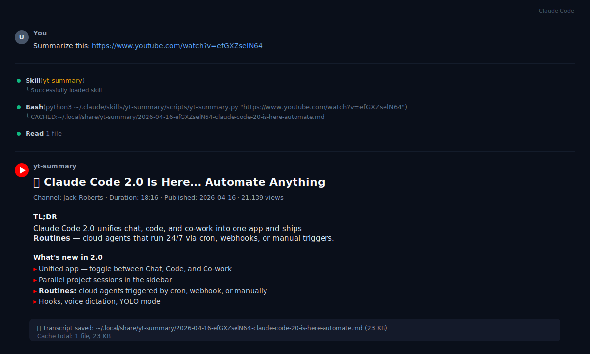

<p align="center">
  <picture>
    <source media="(prefers-color-scheme: dark)" srcset="./assets/hero-dark.svg">
    
  </picture>
</p>

<p align="center">
  <a href="./LICENSE"></a>
  
  
</p>

Paste a YouTube URL into your coding agent and get a clean summary. The full transcript is cached locally so follow-up questions are answered without re-downloading — even across sessions.

Works out of the box with Claude Code, Cursor, OpenCode, and 40+ other agents.

<p align="center">
  
</p>

## How it works


The skill calls `yt-dlp` to fetch the captions, strips timing cues and duplicates, and writes the cleaned transcript to a local cache. Your agent then reads the transcript, picks a format based on the video type (tutorial, interview, news, review, keynote…), and writes the summary in your conversation language.

## Install

First, make sure `yt-dlp` is on your `PATH` — it's the only external tool the skill needs:

```bash
brew install yt-dlp              # macOS
pipx install yt-dlp              # cross-platform (preferred)
pip install yt-dlp               # fallback
winget install yt-dlp.yt-dlp     # Windows
```

Full instructions and standalone binaries for all platforms live at [yt-dlp/yt-dlp](https://github.com/yt-dlp/yt-dlp#installation).

Then install the skill in your agent. Pick whichever path matches your setup:

| Multi-agent (recommended) | Claude Code plugin | Shell fallback |
|:---|:---|:---|
| Auto-detects your agent and copies the skill to the right place. Works with 40+ agents via [`vercel-labs/skills`](https://github.com/vercel-labs/skills). | Install as a native Claude Code plugin. | Detects Claude Code / Cursor / OpenCode and installs manually. |
| `npx skills add ultr4nerd/yt-summary` | `/plugin marketplace add ultr4nerd/yt-summary` then `/plugin install yt-summary@yt-summary` | <code>curl&nbsp;-fsSL&nbsp;https://raw.githubusercontent.com/ultr4nerd/yt-summary/main/install.sh&nbsp;\|&nbsp;bash</code> |

You can force a specific target with the shell fallback:

```bash
AGENT=cursor   bash <(curl -fsSL https://raw.githubusercontent.com/ultr4nerd/yt-summary/main/install.sh)
AGENT=opencode bash <(curl -fsSL https://raw.githubusercontent.com/ultr4nerd/yt-summary/main/install.sh)
AGENT=claude   bash <(curl -fsSL https://raw.githubusercontent.com/ultr4nerd/yt-summary/main/install.sh)
```

### Agent compatibility

| Agent | Native skill support | Install location |
|---|---|---|
| **Claude Code** | ✅ native | `~/.claude/skills/yt-summary/` |
| **Cursor** | ✅ native | `.agents/skills/yt-summary/` (per-project) |
| **OpenCode** | ⚠️ requires a skills loader plugin such as [`malhashemi/opencode-skills`](https://github.com/malhashemi/opencode-skills) | `~/.config/opencode/skills/yt-summary/` |

## Usage

Once installed, there's nothing to remember — paste a YouTube URL into your agent:

```
Summarize this: https://www.youtube.com/watch?v=dQw4w9WgXcQ
```

Or invoke it explicitly:

```
/yt-summary https://www.youtube.com/watch?v=dQw4w9WgXcQ
```

### Multiple videos

Paste several URLs in one message; the skill processes them sequentially and caches each one. Say "compare these" or "what do they have in common" to get a combined comparative summary instead of individual ones.

### Follow-up questions

```
What did Jack say about webhooks in the Claude Code 2.0 video?
```

The skill grep's the cached transcript and answers with literal quotes — no re-download, even across sessions.

## Your cache

- **Where:** `${XDG_DATA_HOME:-~/.local/share}/yt-summary/`
- **What's inside:** one `.md` file per video with YAML frontmatter (metadata) and the cleaned transcript. Summaries are produced fresh each turn — they are not persisted.
- **Size:** typically 20–50 KB per video.
- **Clear it at any time:** `rm -rf ~/.local/share/yt-summary/`

<details>
<summary><b>For contributors</b></summary>

### Project layout

```
yt-summary/
├── .claude-plugin/              # Claude Code plugin manifests
├── skills/yt-summary/
│   ├── SKILL.md                 # the skill definition (Anthropic Agent Skills Spec)
│   └── scripts/yt-summary.py    # the bundled script (Python stdlib only)
├── assets/                      # hero SVGs + demo GIF + VHS tape
├── tests/test_script.py         # 27 tests, no external deps
└── install.sh                   # shell fallback installer
```

### Requirements for running the script directly

- **Python 3.8+** — preinstalled on modern macOS and every Linux distro. On Windows install from the Microsoft Store or with `winget install Python.Python.3`.
- **yt-dlp** — same install commands as above.

The script is plain Python (stdlib only), so it runs natively on macOS, Linux, and Windows — no WSL, no Git Bash required.

### Running the script standalone

```bash
python3 skills/yt-summary/scripts/yt-summary.py https://www.youtube.com/watch?v=dQw4w9WgXcQ
# Prints: NEW:<path> (first time) or CACHED:<path> (subsequent runs)
```

On Windows use `python` or `py -3` if `python3` is not on `PATH`.

### Running the tests

```bash
python3 tests/test_script.py
```

Covers URL parsing, slug generation, VTT cleanup, and every CLI exit code. The happy-path test requires `yt-dlp` and network access; everything else runs offline.

### Standalone-script demo GIF

`assets/demo.gif` is a VHS-recorded terminal capture of the bundled script running end-to-end (cache miss → cache hit). It's there as a sanity check for people who want to see the plumbing without installing a whole agent.

Regenerate it with [`vhs`](https://github.com/charmbracelet/vhs) (`brew install vhs`):

```bash
find ~/.local/share/yt-summary -name '*efGXZselN64*.md' -delete 2>/dev/null
vhs assets/demo.tape
```

</details>

## License

MIT. See [LICENSE](./LICENSE).
